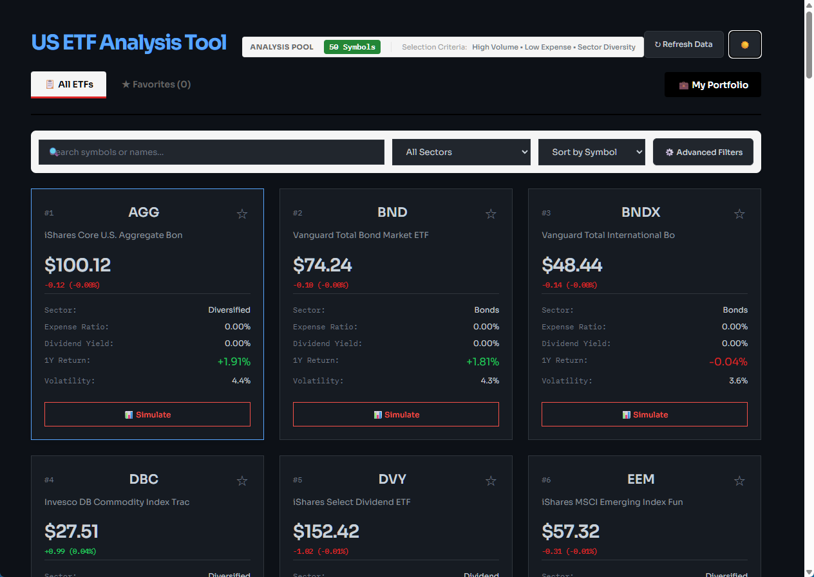

# US ETF Analysis Dashboard

A professional-grade financial dashboard for analyzing US Exchange-Traded Funds (ETFs). Built with a high-performance FastAPI backend and a modern React frontend, focused on providing actionable investment insights.



## 🚀 Key Features

- **Comprehensive ETF Pool**: Real-time analysis of 30+ major US ETFs (VOO, QQQ, SPY, etc.) with automated data synchronization.
- **Advanced Monte Carlo Simulation**: Project future portfolio values using historical volatility and mean returns with high-fidelity path generation.
- **Modern 3-Layer Navigation**: Optimized UI hierarchy featuring a dedicated Brand Bar, Navigation Tabs, and a consolidated Filter Bar.
- **Interactive Price Charts**: High-performance financial charts powered by TradingView's Lightweight Charts.
- **Hybrid Data Engine**: Leverages both `yfinance` and `yahooquery` for maximum data reliability and uptime.
- **Seamless Theme Engine**: Premium Dark and Light mode support with full-page background consistency.

## 🛠 Tech Stack

- **Frontend**: React 18, TypeScript, Vite, Lightweight Charts, Vanilla CSS (Design Tokens).
- **Backend**: FastAPI (Python 3.12), yfinance, yahooquery, NumPy, Pandas, SQLAlchemy.
- **Database**: SQLite for persistent storage of ETF pools and user favorites.

## 📥 Quick Start

### 1. Backend Setup

```bash
cd backend
pip install -r requirements.txt
python -m src.main
```

The API will be available at `http://localhost:8000`.

### 2. Frontend Setup

```bash
cd frontend
npm install
npm run dev
```

The dashboard will be available at `http://localhost:5173`.

## 📄 Documentation

For in-depth technical details, architecture patterns, and developmental roadmap, refer to the guides in the `docs/` folder:

- [Complete Development Guide v1.1](./docs/Complete%20Development%20Guide%20-%20v1.1%20-%202026-03-09.md) - Latest version covering modern UI changes.
- [Complete Development Guide v1.0](./docs/Complete%20Development%20Guide%20-%20v1.0%20-%202026-02-23.md) - Initial foundation guide.

---
© 2026 [VibeAlgoLab](https://github.com/vibealgolab)
